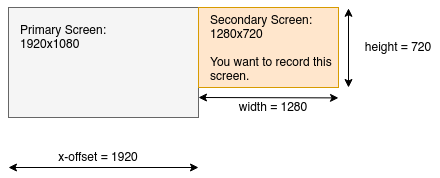

# Screencasting (and podcasting) with Linux


You will find here the tools and explanations to screencast on Linux, that is, to record your computer screen while you speak to a microphone.  This is useful to make video tutorials or online courses.

You will need to have some knowledge of the command line.

The steps we need to follow are:

- record both your screen and your voice,
- mix them into one file,
- edit with a video editor, to insert titles and remove speech issues
  (like “er...”, “oups...”, repetitions, etc.).

I usually don't record everything in one shot, I record smaller chunks and then concatenate them into one video later, as we will see.

Examples of my screencasts may be found on my [YouTube channel](https://www.youtube.com/channel/UCOwucR9MSBbuOsa1owqyM5Q).


## How to record audio and video

Our goal here is to record audio and video at the same time, because making a voice-over (recording the video, and later the audio) is complicated and time consuming.


### Setting the area of the screen to record

Our first goal is to define the area of the screen to record, in terms of width, height and position (how far from the left and top screen borders).

Two possibilities: (1) Use two monitors: one for your notes and controls and one as the recorded area; (2) Record a specific area of your screen, the rest being used for notes and controls.

#### Using two monitors

Using two monitors is the best solution since you can store your notes, slides, windows, etc. on a separate monitor.

Let's say you have two monitors, like this:



Let's say you want to record the secondary monitor in red (it's best to **not** record the primary monitor, since the task bar will be on it, and you don't want to record the taskbar).  The area to record is thus the second monitor:

- width: the width of your monitor (in pixels), for example 1280 for a 1280x720 monitor,
- height: the height of your monitor (in pixels), for example 720 for a 1280x720 monitor,
- the position (x-offset from the left border and y-offset from the top border) of the your monitor.  If your monitors are laid out has in the previous picture, then the y-offset is 0 (because it is at the top), and the x-offset (from the left) is the width of your primary monitor, for example 1920 for a 1920x1080 monitor.

Now you can define your geometry: `width x height + x-offset + y-offset`, so `1280x720+1920+0` in our example.


#### Recording only a smaller area of your screen

If you don't have two monitors and don't want to record your entire monitor, you will need to specify an area of the screen to record, for example a window.

I have written the program `drawframe` to draw a (by default red) frame around a specific area.  You may want to leave the frame during the whole recording, so you know exactly what is the area of the screen which is been recorded, and you can move your notes and other windows around.

To run `drawframe`:

```bash
drawframe 720p
```

if you want to record an area of 1280x720 pixels at x- and y-offset of 100
pixels.  Use the `-h` switch to get other formats.

You can also specify a custom area and a custom offset (for example a
800 by 660-pixel area, at x- and y-offet 50 and 50):

```bash
drawframe 800x600+50+50
```

Use the `-w` option to set the width (thickness) of the frame.

If you want to get the size and position of an open window, use the `get_window_size_n_position.sh` script:

```bash
bash get_window_size_n_position.sh
```

Then click on the window you want to record, and you will get the size and position of the window, for example: `1198x830+32+21`.  You can use this output with `drawframe` to check and draw a frame.


### Setting the audio

Plug your microphone into your computer, and check the audio.  You may use `pavucontrol` to select the correct microphone and adjust the volume, if needed.  You can make a test with [Audacity](https://www.audacityteam.org/).


### Recording audio and video

I prefer to record audio and video in separate files, so I can process them separately (especially to remove noises from the audio before mixing it with the video).


#### Short version

I use `ffmpeg` to record both audio and video.  The general syntax is as follows:

```bash
ffmpeg -framerate 15 -video_size <WIDTH>x<HEIGHT> \
  -f x11grab -i :0.0+<X-OFFSET>,<Y-OFFSET> \
  -f alsa -ac 2 -i pulse \
  -map 0:0 -vcodec libx264 -qp 0 -preset ultrafast video.mp4 \
  -map 1:0 -acodec libmp3lame audio.mp3
```

With this, you will have a `video.mp4` file (without audio) and an `audio.mp3` file (of course without video).

For example, to record a second right 1820x720 monitor (see the example above), use:

```bash
ffmpeg -framerate 15 -video_size 1280x720 \
  -f x11grab -i :0.0+1920,0 \
  -f alsa -ac 2 -i pulse \
  -map 0:0 -vcodec libx264 -qp 0 -preset ultrafast video.mp4 \
  -map 1:0 -acodec libmp3lame audio.mp3
```

To stop the recording, just press `Ctrl-C`, it's ok.


#### Lengthy details and adjustments

You can tweak the quality of the audio and video files, and make other adjustments.  You can skip this section if you're ok with the default settings.

You can add some quality to the mp3 (see [ffmpeg.org[(https://trac.ffmpeg.org/wiki/Encode/MP3)) with the option:

```bash
-q:a 1
```

You can record in different formats.  For the audio, you may want to record raw data:

```bash
-map 1:0 -acodec pcm_s16le audio.wav
```

but in this case you must include the `-crf 0` option (constant rate frame)
in the video line:

```bash
-map 0:0 -vcodec libx264 -crf 0 -qp 0 -preset ultrafast video.mp4
```

(this one or the ones below), otherwise the audio will be cut and the two files (audio and video) will not have the same length.  If you use mp3, you don't need to do it.

For video, you can try one of the following:

```bash
-map 0:0 -vcodec mpeg4 video.mp4 # this is mpeg
-map 0:0 -vcodec libx264 -crf 0 -qp 0 -preset ultrafast video.mp4 # h264
-map 0:0 -vcodec libx264 -qp 0 -preset ultrafast video.mp4
-map 0:0 -vcodec libx264 -crf 0 video.mp4
-map 0:0 -vcodec libx264 -crf 0 video.mkv
```

The best is to record in h264 in mp4 (Youtube doesn't allow you to upload mkv).

Here is a bash script to make some tests (just copy that in a new directory in `/tmp/vid` for example):

```bash
rm *.mp4 *.mkv *.wav *.mp3
ffmpeg -framerate 15 -video_size 1280x720 \
   -f x11grab -i :0.0+1920,0 \
   -f alsa -ac 2 -i pulse \
   `#-map 0:0 -vcodec mpeg4 video.mp4` \
   `#-map 0:0 -vcodec libx264 -crf 0 -qp 0 -preset ultrafast video.mp4` \
   -map 0:0 -vcodec libx264 -qp 0 -preset ultrafast video.mp4 \
   `#-map 0:0 -vcodec libx264 -crf 0 video.mp4` \
   `#-map 0:0 -vcodec libx264 -crf 0 video.mkv` \
   `#-map 1:0 -acodec pcm_s16le audio.wav` \
   -map 1:0 -acodec libmp3lame audio.mp3
```


### A script to record several files in a row

I don't usually record everything in one shot.  I split my script into chunks and sometimes start again over and over because of speech problems (“er”, “oups”, repetition, forgetting what I want to say, etc.).  So I end up with several chunks: some go directly to the trash, and I assemble the other ones in a video editor later.

The (Perl) script `record_videos_in_a_row.pl` allows you to do this:

```bash
perl record_videos_in_a_row.pl 1820 720 1920 0
```

It will ask you to press `Enter` to start recording, and `Ctrl-C` to stop, and wait for the next recording.  Each time you press `Enter` and `Ctrl-C`, it will create two files named:

- `01.mp3` and `01.mp4`,
- `02.mp3` and `02.mp4`,
- `03.mp3` and `03.mp4`,
- etc.

If you stop the script and want to relaunch it, but already have a serie
of `01`, `02`, `03`... files, then you can add the next counter at the end of
the parameter list:

```bash
perl record_videos_in_a_row.pl 1820 720 1920 0 4
```

 
## Mixing audio and video


### Clean the audio

You may want to edit the audio, for example normalizing the sound and reducing the noise.   I use the audacity for that.  You just have to import each `.mp3` file, use the `noise reduction` (and maybe the `normalization`) filter and save the file back to the disk.


### Merging audio and video

Now we want to merge the audio and video into one file:

```bash
ffmpeg -i video.mp4 -i cleaned-audio.mp3 -vcodec copy -acodec copy merged.mp4
```

Note that if you have decided to save the audio in raw format (`.wav`) rather than in `.mp3`, use:

```bash
ffmpeg -i video.mp4 -i cleaned-audio.wav -vcodec copy -acodec mp3 merged.mp4
```

You will need to do this for each file `01.mp3` and `01.mp4`, `02.mp3` and `02.mp4`, etc., so you can use a loop:

```bash
for f in *.mp4:
do
   fn=$(basename -s .mp4 $f)
   ffmpeg -i $fn.mp4 -i $fn.mp3 -vcodec copy -acodec copy $fn-merged.mp4
done
```

Use the `merge.sh` script to do that:

```bash
bash merge.sh path/to/dir
```


### Editing in a video editor

Now you can edit the merged file with [Openshot](https://www.openshot.org/) or [Shotcut](https://www.shotcutapp.com/) (for example).  These are video editor where you can cut and concatenate your file, remove parts and add title, images, etc.


## Export settings

Here the options I have used to export my videos.  Note that Shotcut has
a profile for Youtube.

Profile (HDV 720 24p 1280x720):

- resolution: `1280x720` (width x height)
- aspect ratio: `16:9`
- pixel ratio: `1`
- frame rate: `15 frames/sec`
- interlaced: `no` (or `yadif`)
- scan mode: `progressive`
- interpolation: `bilinear`


Video:

- format: `mp4`
- codec: `libx264`
- GOP: `30 frames`
- B frames: `2`
- rate control: `average bitrate`
- bit rate / quality: `256 kb/s`

Audio:

- codec: `libvo_aacenc` (or `aac` depending of the software)
- sample rate: `44100 Hz`
- channel layout: `stereo`
- rate control: `average bitrate`
- bit rate / quality: `128 kb/s`


## What if you prefer a voice-over

You may want to edit the video, then record the voice over in high quality with audacity, without keyboard strokes.  Just open audacity, and play the video while recording.  You must be synchronized!  To merge, use the video editor (but this might re-encode the video, which is lossy and time-consuming), or one of the above commands.

You may want to edit the video and export it with the original sound (as a guide), or without it.  Then record a new voice over and edit the new sound in audacity, then export it.  If you have exported the original sound, you will need to replace it by the new sound:


## Other tools

I have learned that you can [record with VLC](https://www.maketecheasier.com/record-windows10-screen-vlc/).


## Licence

All the scripts in this repositories are distributed under the terms of the MIT license (see the `LICENSE` file).

